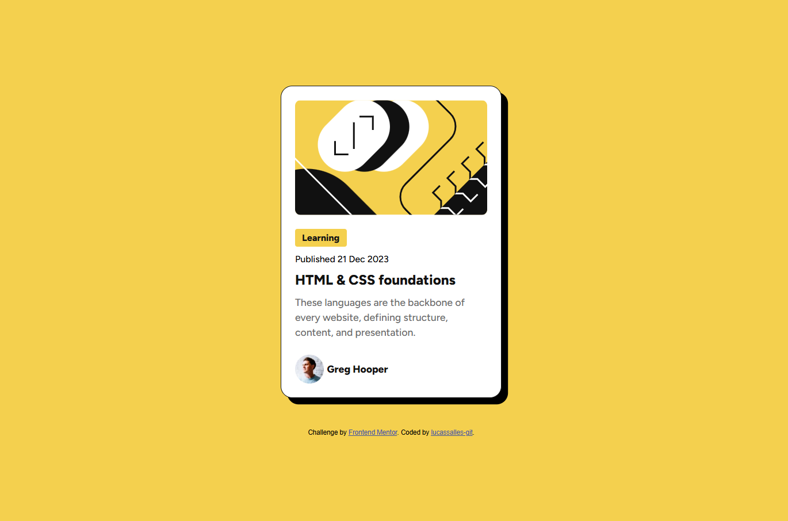

# Mentor Frontend - QR Code Component Solution

This is my solution for the [Blog preview card challenge on Mentor Frontend](https://www.frontendmentor.io/challenges/qr-code-component-iux_sIO_H). Mentor Frontend challenges help you hone your sourcing skills by creating realistic projects.

## Table of Contents

- [Overview](#overview)
- [Screenshot](#screenshot)
- [Links](#links)
- [My Process](#my-process)
- [Built With](#built-with)
- [What I Learned](#what-i-learned)
- [Continuous Development](#continuous-development)
- [Helpful Resources](#helpful-resources)
- [Author](#author)

##Overview

I created a blog card with HTML and CSS. The goal was to practice semantic HTML, responsiveness, and to organize a card in a screen-centered manner with reduced font sizes for smaller screens without using media queries.

### Screenshot



###Links

- Solution URL: [https://github.com/lucassalles-git/blog-preview-card]
(https://github.com/lucassalles-git/blog-preview-card)
- Live site URL: [https://lucassalles-git.github.io/blog-preview-card/]
(https://lucassalles-git.github.io/blog-preview-card/)

### Built with

- Semantic HTML5
- CSS3
- Flexible Box
- Grid
- Media Queries
- Mobile-First Layout

###What I Learned

I learned how to:

- Slightly shrink and enlarge fonts without having to use media queries, just using ``clamp()``:
```css
h1 { 
font-size: clamp(1.2rem, 6vw, 1.5rem);
}

```

## Author

- GitHub - @[lucassalles-git]

- Front-end Mentor - @[lucassalles-git]